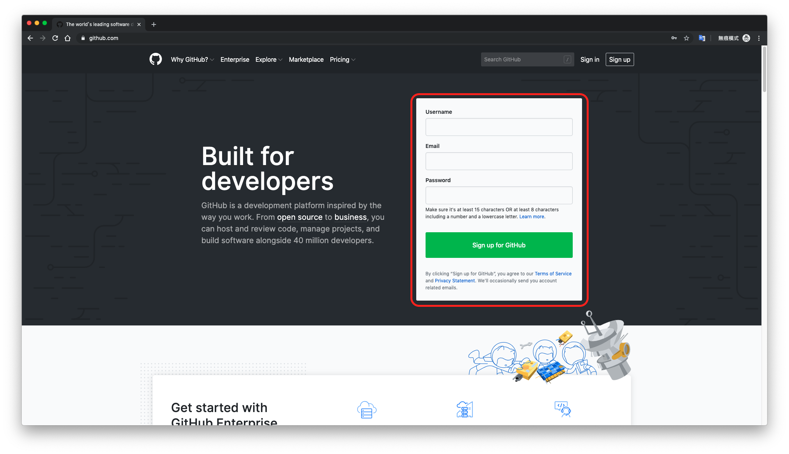

# 11/1 技術部部聚要準備的東西

Author: Jerry

## 1. 安裝 Git

安裝檔到[這個網站](https://git-scm.com/downloads)下載，底下有詳細的安裝步驟

* Windows<br>
[https://gitbook.tw/chapters/environment/install-git-in-windows.html](https://gitbook.tw/chapters/environment/install-git-in-windows.html)
* macOS<br>
[https://gitbook.tw/chapters/environment/install-git-in-mac.html](https://gitbook.tw/chapters/environment/install-git-in-mac.html)
* Linux<br>
[https://gitbook.tw/chapters/environment/install-git-in-linux.html](https://gitbook.tw/chapters/environment/install-git-in-linux.html)

接下來要用幾個指令測試 Git 有沒有裝好，如果是 Windows 的話打開 **Git Bash** 這個程式，macOS 或是 Linux 則是打開 **Terminal**，輸入底下兩個指令，基本上有東西跑出來就表示成功了

```bash
$ which git
```
我的電腦回傳 `/usr/local/bin/git`

```bash
$ git --version
```

我的電腦回傳 `git version 2.15.1`<br>
> P.S. 現在最新的應該是 `2.23.0`


## 2. 註冊 GitHub 帳號

GitHub 網址在這：[https://github.com/](https://github.com/)<br>
就長得像下面截圖那樣，直接點 `Sign up for GitHub` 就可以開始註冊了<br>
想要看一步一步教你怎麼註冊的，[這個網頁](https://progressbar.tw/posts/3)前面的部分有介紹註冊的步驟（如果你很熟悉怎麼註冊帳號就不用特別點進去看了啦）


## 3. 安裝 GitHub Desktop

從[這裡](https://desktop.github.com/)下載安裝檔<br>
安裝的時候可以直接登入剛剛註冊好的帳號<br>
一樣[這邊](https://progressbar.tw/posts/49)有教學，如果有需要可以去看

## 4. 安裝 Text Editor

選一個自己喜歡的就好，底下有一些大家常用的，可以參考一下

* [Sublime Text](https://www.sublimetext.com/)
* [Atom](https://atom.io/)
* [Visual Studio Code](https://code.visualstudio.com/)
* [Notepad++](https://notepad-plus-plus.org/downloads/)
